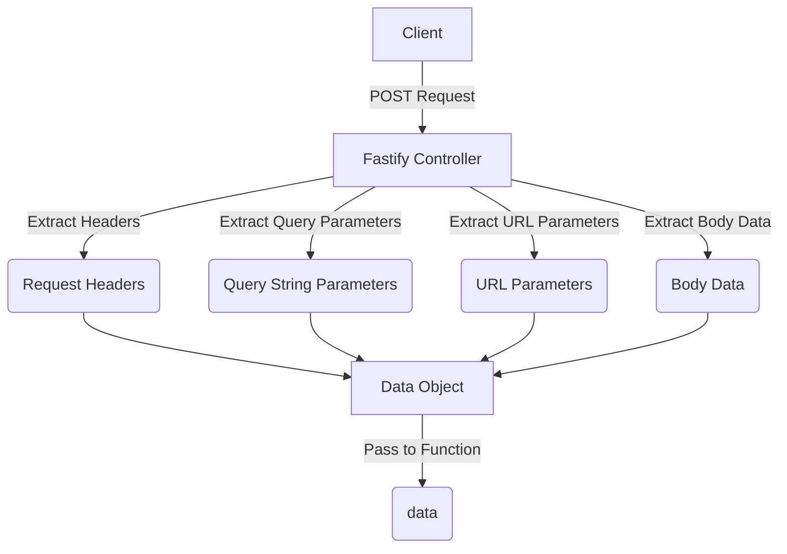

# Notes

## Thoughts on how to handle data passed in a HTTP Request to a service function

One of the current challenges of using this library to DRY up and serve a REST 
API is that data can be passed to a HTTP Request in multiple ways, and the service 
function expects data to arrive in a single object, so there needs to be a way to 
map what data from the HTTP API Request should go to the service function, and how.

For example, a HTTP POST API Request might pass data via these channels:

* The request headers (e.g. Authorization: Bearer xxxxxx)
* As querystring parameters in a url e.g. ?type=documents
* As parameters in a url for sluggable urls (e.g. /cities/london/rentals -> city: "london")
* As a JSON payload in the request body
* Potentially as binary data in a HTTP multipart form submission

Therefore, finding a way to map data coming from these channels to the data 
object passed to a service function becomes key.

I wonder if the generate controller action can be fed some configuration 
options to control how data is extracted from parameters.

I think the `getParams` function in the `controller.ts` file is the candidate
here. You could create a default version of the function that is able to 
extract parameters from the various sources.

In theory, the service function could specify what the data payload it expects
should look like for the function, and then the controller works out which 
fields come from what data channels, and then it applies the mapping as 
appropriate.